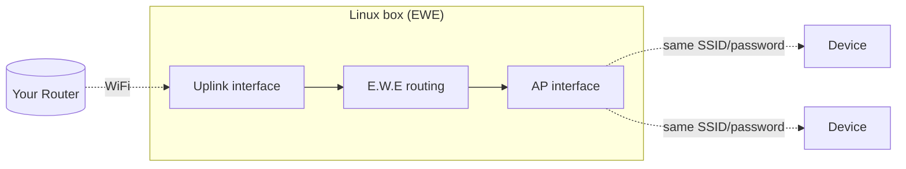

<div align="center">

# E.W.E — Easy WiFi Extender

**Turn any Linux box with two WiFi radios into a simple WiFi extender.**

[](LICENSE)
[](https://www.python.org/)
[](https://docs.astral.sh/uv/)
[](#requirements)
[](#ai-development-disclosure)

*One interface joins your existing WiFi. The other rebroadcasts it.*

</div>

---

## How it works

One interface (**uplink**) joins your existing network as a normal client. The other (**AP**) broadcasts the extended network through [`lnxrouter`](https://github.com/garywill/linux-router).



EWE uses two physical WiFi radios, so the AP adapter does not need to support client + AP operation simultaneously.

> [!WARNING]
>
> ### Performance vs. Range
>
> E.W.E is primarily designed to **extend WiFi coverage and reach**, not to guarantee the same internet speed as your main router. Because traffic passes through an additional wireless link, **download and upload speeds may be significantly slower than the original connection**, depending on your WiFi adapters, drivers, channel conditions, and network setup.
>
> The goal of EWE is simple: **more coverage, not necessarily more speed**.

## Requirements

* Linux with **two WiFi interfaces** (built-in + USB dongle works fine).
* `systemd` for boot autostart.
* Root/sudo — EWE requires root privileges.
* Python **3.11+**.
* Internet access during initial installation to fetch `lnxrouter` and dependencies.

> [!IMPORTANT]
> The **AP-side** interface must support AP mode:
>
> ```bash
> iw list
> ```
>
> Look for:
>
> ```text
> Supported interface modes:
>     * AP
> ```
>
> No `AP` → that adapter cannot host the extended network.

Cheap Realtek USB dongles are a common culprit, so check Linux driver support before buying one for this.

## Install

One command:

```bash
curl -LsSf https://astral.sh/uv/install.sh | sh && source $HOME/.local/bin/env && uv tool install "git+https://github.com/PauWol/E.W.E"
```

Already have `uv`?

```bash
uv tool install "git+https://github.com/PauWol/E.W.E"
```

```bash
ewe --help
```

> [!WARNING]
> **`git operation failed` / `git executable not found`**
>
> E.W.E installs `lnxrouter` directly from GitHub. If Git is missing, install it first.

<details>
<summary>Install Git</summary>

**Arch / CachyOS**

```bash
sudo pacman -S git
```

**Debian / Ubuntu / Raspberry Pi OS**

```bash
sudo apt install git
```

**Fedora**

```bash
sudo dnf install git
```

**openSUSE**

```bash
sudo zypper install git
```

Then retry:

```bash
uv tool install "git+https://github.com/PauWol/E.W.E"
```

</details>

## Quick start

```bash
ewe
```

or:

```bash
ewe --setup
```

The setup wizard walks you through:

* detecting WiFi interfaces
* choosing uplink and AP interfaces, with recommended defaults
* entering SSID and password
* selecting an optional AP channel
* reviewing the configuration
* saving it to `~/ewe/.env`
* optionally installing and enabling systemd autostart

The same SSID and password are used for both networks by default.

<details>
<summary>Example run</summary>

```text
pi@ewe:~ $ ewe
[18:32:30] INFO     ewe.foundation.util       Root privileges required, re-running with sudo...
  ✓ All required dependencies are available.
╭────────────────────────────────────────╮
│ E.W.E                                  │
│ Easy WiFi Extender — interactive setup │
╰────────────────────────────────────────╯
  › Scanning for wireless interfaces...
  ✓ Found 2 wireless interfaces:
    • wlan1
    • wlan0
[18:32:32] INFO     ewe.foundation.util       Recommended WiFi configuration: uplink=wlan0, AP=wlan1

[1/5] Choose wireless interfaces
──────────────────────────────────────────────────────────────────────────────────────────────────────────────────────────────────────────────────────────────────────────────────────────────
  Interface for connecting to your existing WiFi
    1) wlan1
    2) wlan0 (recommended)
  Choose (2): 
  › Interface for broadcasting the extended network: using wlan1 (only option available)
  ✓ Uplink: wlan0
  ✓ AP:     wlan1

[2/5] Configure WiFi
──────────────────────────────────────────────────────────────────────────────────────────────────────────────────────────────────────────────────────────────────────────────────────────────
WiFi network name (SSID) (): homenet
WiFi password (): 
  ✓ WiFi credentials look valid.

[3/5] Configure access point
──────────────────────────────────────────────────────────────────────────────────────────────────────────────────────────────────────────────────────────────────────────────────────────────
Channel (blank = automatic) (): 

[4/5] Review configuration
──────────────────────────────────────────────────────────────────────────────────────────────────────────────────────────────────────────────────────────────────────────────────────────────
         Configuration         
┌──────────────────┬──────────┐
│ Uplink interface │ wlan0    │
│ AP interface     │ wlan1    │
│ SSID             │ homenet  │
│ Password         │ ho••••et │
│ Channel          │ Auto     │
└──────────────────┴──────────┘
Start EWE with these settings? [y/n] (y): 

[5/5] Optional autostart
──────────────────────────────────────────────────────────────────────────────────────────────────────────────────────────────────────────────────────────────────────────────────────────────
Save these settings to ~/ewe/.env? [y/n] (y): 
  ✓ Settings saved to /home/pi/ewe/.env
Install EWE as a systemd service? [y/n] (y): 
Start the service now? [y/n] (n): 
  › Installing systemd service...
Created symlink '/etc/systemd/system/multi-user.target.wants/ewe.service' → '/etc/systemd/system/ewe.service'.
[18:32:50] INFO     ewe.wifi.service          Installed and enabled /etc/systemd/system/ewe.service
[18:32:50] INFO     ewe.wifi.service          Using config: /home/pi/ewe/.env
  ✓ ewe.service installed and enabled.
──────────────────────────────────────────────────────────────────────────────────────────────────────────────────────────────────────────────────────────────────────────────────────────────
  › Starting EWE manually...
──────────────────────────────────────────────────────────────────────────────────────────────────────────────────────────────────────────────────────────────────────────────────────────────
  › Connecting to homenet using wlan0...
[18:32:50] INFO     ewe.wifi.repeater         Connecting wlan0 to 'homenet' via NetworkManager
Connection 'ewe-uplink-wlan0' (d325e72c-7c4e-46ad-a56c-6be6fe3cfede) successfully deleted.
Connection 'ewe-uplink-wlan0' (8317b7df-a2d2-43a2-bfba-1ced986fae0c) successfully added.
Connection successfully activated (D-Bus active path: /org/freedesktop/NetworkManager/ActiveConnection/4)
[18:32:53] INFO     ewe.wifi.repeater         Disabled WiFi power saving on wlan0
[18:32:53] INFO     ewe.wifi.repeater         Disabled WiFi power saving on wlan1
  ✓ Uplink connected.
  › Starting access point on wlan1 (automatic channel)...
[18:32:53] INFO     ewe.wifi.repeater         Releasing wlan1 from NetworkManager for AP mode
Device 'wlan1' successfully disconnected.
[18:32:54] INFO     ewe.wifi.repeater         wlan1 is ready for AP mode
[18:32:54] INFO     ewe.wifi.repeater         Starting access point 'homenet-E.W.E' on wlan1, routing through wlan0
...
```

</details>

## Update

Already installed E.W.E? Update the `uv` tool directly from the repository:

```bash
uv tool upgrade ewe
````

To reinstall the latest repository version explicitly:

```bash
uv tool install --force "git+https://github.com/PauWol/E.W.E"
```

Check the installed version with:

```bash
ewe --version
```

For a normal user, I’d recommend just `uv tool upgrade ewe`; the `--force` command is useful when you want to explicitly refresh the Git-based installation.


## CLI

| Command              | Description                                  |
| -------------------- | -------------------------------------------- |
| `ewe`                | Start the interactive setup wizard           |
| `ewe --setup`        | Start the setup wizard explicitly            |
| `ewe --from-env`     | Start using the saved configuration          |
| `ewe --install-deps` | Check/install required dependencies and exit |
| `ewe --help`         | Show CLI help                                |

`--from-env` is non-interactive and is intended for systemd.

## Boot autostart

Enabled during setup, `ewe.service` runs:

```bash
ewe --from-env
```

and reads:

```text
~/ewe/.env
```

Standard systemd controls:

```bash
sudo systemctl status ewe
sudo systemctl restart ewe
sudo systemctl stop ewe
sudo journalctl -u ewe -f
```

## Configuration

`~/ewe/.env`, plain `KEY=value`:

| Key                        | Meaning                                    |
| -------------------------- | ------------------------------------------ |
| `WIFI_SSID` / `WIFI_PSK`   | Shared by uplink and AP                    |
| `WIFI_UPLINK_IFACE`        | Interface joining your existing WiFi       |
| `WIFI_AP_IFACE`            | Interface broadcasting the extended AP     |
| `WIFI_CHANNEL`             | Optional; blank = auto                     |
| `LOG_LEVEL` / `LOG_FILE`   | Default `INFO` / `~/ewe/ewe.log`           |
| `WIFI_SSID_NAME_EXTENSION` | Whether to add a name extension for the AP |
| `WIFI_POWER_SAVING_OFF`    | Whether WiFi power saving is disabled      |

Edit by hand, or rerun:

```bash
ewe --setup
```

> [!WARNING]
> `WIFI_PSK` is stored in plain text. Keep `~/ewe/.env` private.

## Notes

> [!NOTE]
> **NetworkManager and the AP interface**
>
> EWE temporarily disconnects the AP interface from NetworkManager before starting `lnxrouter`, then restores NetworkManager management when EWE exits.
>
> You normally do **not** need to run `nmcli` manually.

> [!IMPORTANT]
> EWE uses `lnxrouter --no-virt` and the physical AP interface directly. This is useful for adapters that support AP mode but do not advertise simultaneous virtual interface combinations.

> [!TIP]
> **Same SSID or separate SSID?**
>
> Using the same SSID and password can provide a familiar roaming experience, but client roaming is ultimately controlled by the client device. For easier testing, use a distinct AP SSID such as `HomeNet-E.W.E`.
> The `-E.W.E` extension is added by default, in order to disable and use pure input SSID set this as the environment variable: `WIFI_SSID_NAME_EXTENSION=0`

> [!NOTE]
> Some chipsets cannot run client + AP mode on **one** radio simultaneously. This is why EWE requires two separate WiFi interfaces.
>
> The first `ewe` run needs internet access to fetch `lnxrouter` and any missing dependencies.

## Troubleshooting

Check the interfaces:

```bash
iw dev
```

Check AP support:

```bash
iw list
```

Check drivers:

```bash
ethtool -i wlan0
ethtool -i wlan1
```

Check NetworkManager:

```bash
nmcli device status
```

Check EWE logs:

```bash
sudo journalctl -u ewe -f
```

For hardware-specific issues, include the output of the commands above when reporting a problem.

## Uninstall

```bash
sudo systemctl disable --now ewe.service
sudo rm -f /etc/systemd/system/ewe.service
sudo systemctl daemon-reload
uv tool uninstall ewe
rm -rf ~/ewe
```

## AI Development Disclosure

**E.W.E is developed with human-led engineering and AI-assisted development.**

| Area | Development |
| --- | --- |
| Core utilities | Human-designed and implemented |
| Architecture & structure | Human-designed and implemented |
| Project concept | Entirely human-originated |
| WiFi repeater logic | Human + AI collaboration, iterated through testing |
| CLI & UX | AI-generated, currently under human review and validation |

AI-generated code is reviewed, tested, and refined before being treated as production-ready.

## Contributing

Issues and PRs welcome, especially reports from unusual hardware, WiFi drivers, and non-Debian distributions.

## License

[MIT](LICENSE)
