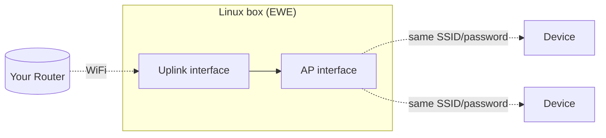

<div align="center">

# E.W.E — Easy WiFi Extender

**Turn any Linux box with two WiFi radios into a seamless WiFi repeater.**

[](LICENSE)
[](https://www.python.org/)
[](https://docs.astral.sh/uv/)
[](#requirements)

*One interface joins your existing WiFi. The other rebroadcasts it. Same SSID, same password, no dead zones.*

</div>

---

## How it works

One interface (**uplink**) joins your existing network like any client. The other (**AP**) rebroadcasts it via [`lnxrouter`](https://github.com/garywill/linux-router) — the maintained successor to the abandoned `create_ap`. Both sides share one SSID/password by default, so devices roam without reconnecting.



> [!WARNING]
>
> ### Performance vs. Range
>
> E.W.E is primarily designed to **extend WiFi coverage and reach**, not to guarantee the same internet speed as your main router. Because traffic passes through an additional wireless link, **download and upload speeds may be significantly slower than the original connection**, depending on your WiFi adapters, drivers, channel conditions, and network setup.
>
> The goal of E.W.E is simple: **more coverage, not necessarily more speed**. Performance improvements and further optimization may receive more attention in future development.


## Requirements

- Linux with **two WiFi interfaces** (built-in + USB dongle works fine).
- `systemd` (for boot autostart).
- Root/sudo — EWE re-execs itself with `sudo` if needed.

> [!IMPORTANT]
> The **AP-side** interface must support AP mode:
> ```bash
> iw list | grep -A 10 "Supported interface modes" | grep AP
> ```
> No `AP` in the output → that adapter can join a network but can't host one. Cheap Realtek USB dongles are a common culprit — check reviews before buying one for this.

## Install

One command, no pre-installed tooling required:

```bash
sudo curl -LsSf https://astral.sh/uv/install.sh | sh && source $HOME/.local/bin/env && uv tool install "git+https://github.com/PauWol/E.W.E"
```

Already have `uv`?

```bash
uv tool install "git+https://github.com/PauWol/E.W.E"
```

```bash
sudo ewe --help   # verify it landed
```

> [!WARNING]
> **`git operation failed` / `git executable not found`**
>
> E.W.E installs `lnxrouter` directly from GitHub. If you see this error, Git is not installed on your system.

<details>
<summary>Install Git</summary>

**Arch / CachyOS**

```bash
sudo pacman -S git
```

**Debian / Ubuntu / Raspberry Pi OS**

```bash
sudo apt install git
```

**Fedora**

```bash
sudo dnf install git
```

**openSUSE**

```bash
sudo zypper install git
```

Then retry:

```bash
uv tool install "git+https://github.com/PauWol/E.W.E"
```

</details>


## Quick start

```bash
sudo ewe
```

Walks you through: dependency check & install → pick uplink/AP interfaces → SSID & password (asked once, used for both) → save to `~/ewe/.env` → optional systemd autostart → launch.

<details>
<summary>Example run</summary>

```
=== E.W.E — Easy WiFi Extender ===

Interface to CONNECT to your existing WiFi (uplink):
  1) wlan0
  2) wlan1
  Choose 1-2: 1
Interface to BROADCAST the extended AP: using 'wlan1' (only option available)
WiFi network name (SSID) — used for both connecting and the new AP: HomeNet
WiFi password — same for both networks:
Channel (blank = auto):

Proceed? [Y/n]: y
Save these settings to ~/ewe/.env for autostart on boot? [Y/n]: y
Install + enable a systemd service so this starts automatically on boot? [Y/n]: y
Start it now too (in addition to enabling it)? [y/N]: y
ewe.service installed and enabled.
```

</details>

## Boot autostart

Enabled during setup, `ewe.service` reads config from `~/ewe/.env` on every boot. Standard systemd controls:

```bash
sudo systemctl status ewe
sudo systemctl restart ewe
journalctl -u ewe -f
```

Skipped it during setup? Re-run `sudo ewe` — it reuses your saved config and offers the systemd step again.

## Configuration

`~/ewe/.env`, plain `KEY=value`:

| Key | Meaning |
| --- | --- |
| `WIFI_SSID` / `WIFI_PSK` | Shared by uplink and AP |
| `WIFI_UPLINK_IFACE` | Interface joining your existing WiFi |
| `WIFI_AP_IFACE` | Interface broadcasting the extended AP |
| `WIFI_CHANNEL` | Optional; blank = auto |
| `LOG_LEVEL` / `LOG_FILE` | Default `INFO` / `~/ewe/ewe.log` |

Edit by hand, or re-run `sudo ewe` to overwrite via the prompts.

## Notes

> [!TIP]
> **Sticky clients on same-SSID roaming?** Pin both interfaces to the same channel, or give the AP a distinct SSID (e.g. `HomeNet_EXT`) by hand-editing `.env`.

> [!WARNING]
> **NetworkManager may grab the AP interface** and fight `lnxrouter` for it. Fix:
> ```bash
> nmcli device set <ap_iface> managed no
> ```

> [!NOTE]
> Some chipsets (older Raspberry Pi Broadcom radios included) can't run client + AP mode on **one** radio simultaneously — this is why EWE needs two separate interfaces.
>
> First boot after enabling the service: give it 20–30s to bring up the uplink before the AP can bridge through it.
>
> The first `sudo ewe` run needs internet access (Ethernet or existing WiFi) to fetch `lnxrouter` and any missing packages.

## Uninstall

```bash
sudo systemctl disable --now ewe.service
sudo rm -f /etc/systemd/system/ewe.service
uv tool uninstall ewe
rm -rf ~/ewe
```

## Contributing

Issues and PRs welcome, especially reports from unusual hardware or non-Debian distros.

## License

[MIT](LICENSE)
